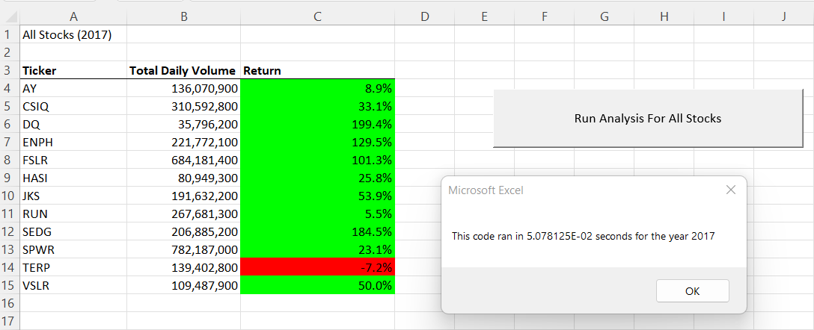
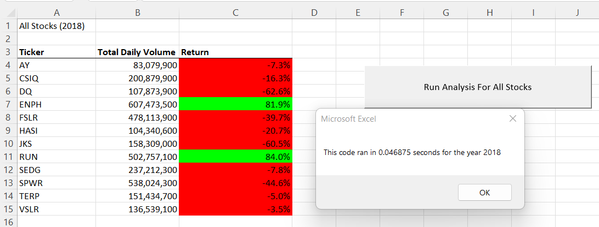

# stock-analysis
## Colin Leung

## Overview of Project
Steve, whom I am helping, wishes to analyze the entire stock market over the past few years. This project uses VBA in Excel to gather the Total Daily Volume for each stock in our given data set and determine the percentage of return and whether that return is a positive or negative amount. Additionally, I tested the efficiency of the VBA code to determine the total run time to analyze the stocks data set for 2017 and 2018.

## Results
### 2017

As seen in the pop-up, for the year 2017, the VBA code took about 0.05 seconds to run completely. The column A in the Excel sheet shows the ticker symbols, column B shows the Total Daily Volume for the ticker in the corresponding row and column C shows the return percentages. Additionally, to simplify determining whether the return for a stock was positive or negative, the 'Return' cell is either green or red where green represents positive returns and red represents negative. As seen in the image, 2017 was a good year for these stocks since most of the returns were green or positive.

### 2018

For the year 2018, the VBA code ran in about 0.04 seconds which is slightly faster than 2017. The columns for 2018 represent the same values as the corresponding columns in the year 2017 and the color for the cells also represent the same meaning. Since most of the stocks are red in the 2018 analysis, most of the stocks had a negative return. Clearly, the year 2017 had a better performance in these stocks than the year 2018. 

## Summary
Refactoring is the process of making code more efficeint. This simplifies the code to make it shorter and shortens run times. This is important for huge data sets since creating a code for each subset of the data would take a lot more time and take a lot longer to run as compared to having a single code that applies to everything. The disadvantages for refactoring is the difficulties and complications of the coding. For instance, whereas a copied code that applies to each subset of the data would work every time, a 'for loop' would be a lot quicker to code, but requires more complex functions within it.

### Pros and Cons of Refactoring in this project
In this project, the given data set was very large. Creating a code for each individual data point would take too much time and become too difficult to read. By using a 'for loop', the code runs through the entire data set without needing to include every data cell in the code, thus making the run time so short. Without using a 'for loop', the analysis would have still worked with an equal level of precision. Refactoring only optimizes the efficiency of the code and does not affect the results or the analysis gathered. 
